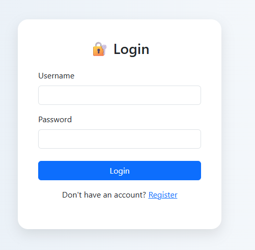
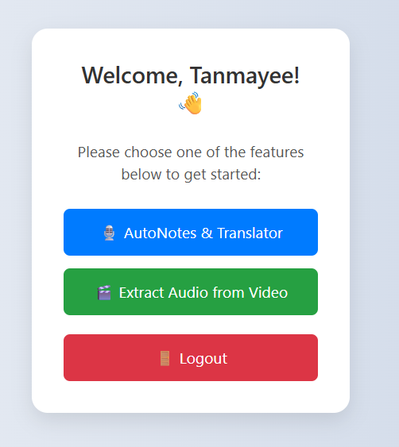
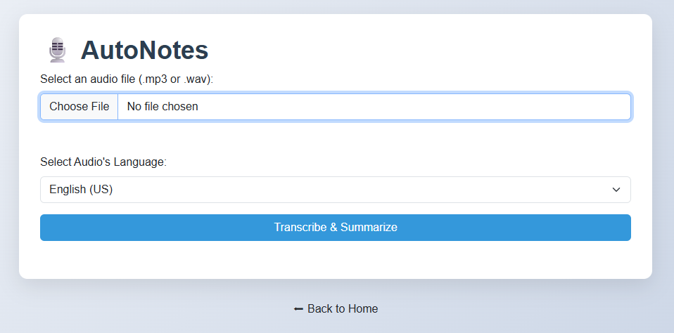
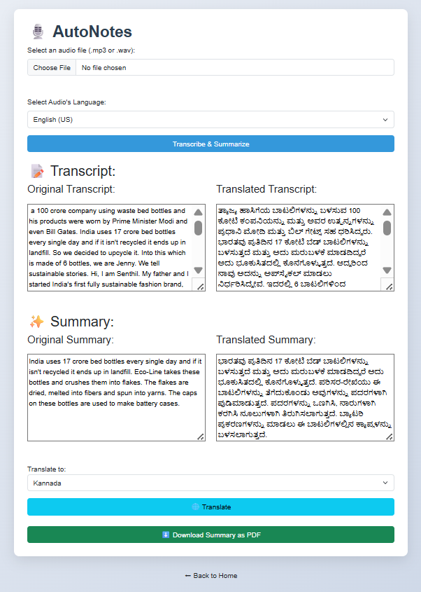
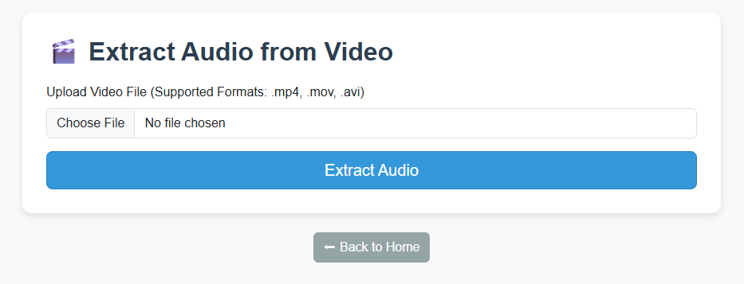
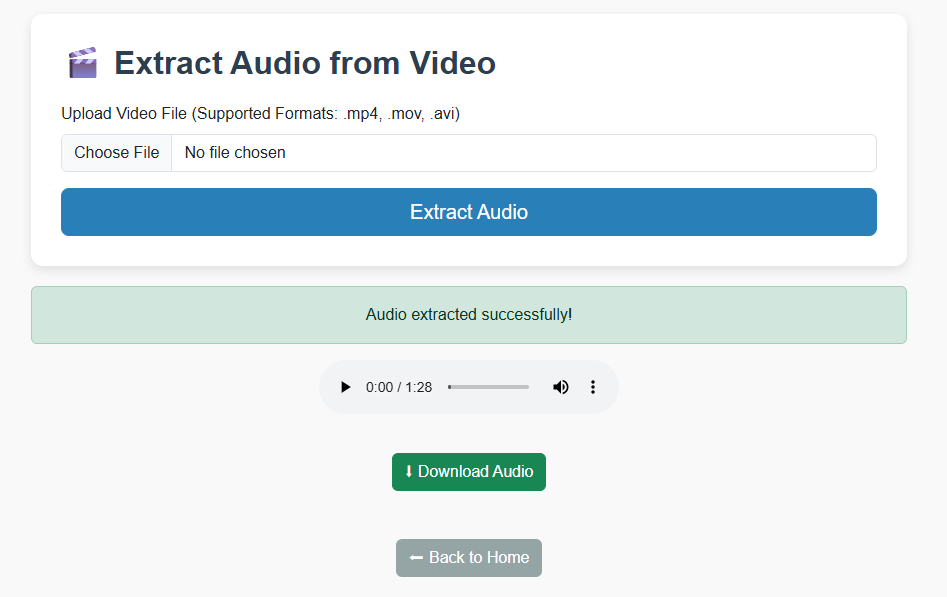

# 📝 Auto Notes & Audio Extractor

AutoNotes & Audio Extractor is an AI-powered web app to transcribe voice/audio, extract audio from video, summarize the content, and translate it into multiple languages. It’s perfect for students, creators, and professionals.

---

## 🚀 Features

- 🔐 **User Login System** – Secure login and personalized dashboard.
- 📁 **My Notes Page** – Logged-in users can view their past uploads.
- 🎙️ **Audio Transcription** – Upload audio and get accurate transcriptions using OpenAI Whisper.
- 🎞️ **Audio from Video** – Extract audio from uploaded video files.
- 📄 **Automatic Summarization** – Generate concise summaries from long transcripts.
- 🌐 **Multi-language Translation** – Translate transcripts and summaries into different languages.
- 📤 Export as PDF – Download transcriptions and summaries as PDF files.
  
---

## 🛠️ Tech Stack

- **Backend:** Python (Flask)
- **Frontend:** HTML, CSS, Bootstrap
- **AI Models:** OpenAI Whisper, HuggingFace Transformers
- **Translation:** deep-translator (free and offline-compatible)
- **Database:** SQLite
- **Authentication:** Flask-Login
- **Media Processing:** ffmpeg

---

## 📂 Project Structure

<pre>
Autonotes&Audioextractor/
│
├── static/
│   └── css, js, uploads
├── templates/
│   └── base.html, login.html, dashboard.html, transcriber.html, ...
├── screenshots/
│   └── Home.png, Login.png, Autonotes.png, Autonotes output.png, Audioextractor.png, Audioextractor output.png
├── venv/
├── instance/
│   └── database.sqlite3
├── app.py
├── requirements.txt
└── README.md
</pre>

---

## ⚙️ Setup Instructions

### 1. Clone the Repository

```bash
git clone https://github.com/codebisleri/autonotes-audioextractor.git
cd autonotes-audioextractor
```

### 2. Create and Activate Virtual Environment

```bash
python -m venv venv
venv\Scripts\activate        # On Windows
# or
source venv/bin/activate       # On Mac/Linux
```

### 3. Install Requirements

```bash
pip install -r requirements.txt
```

### 4. Run the App

```bash
python app.py
```

Visit `http://localhost:5000` in your browser.

---

## 📸 Screenshots

### Login Page


### Home Page


### AutoNotes Interface


### AutoNotes Output


### Audio Extractor Interface


### Audio Extractor Output



---

## 🔮 Future Enhancements

- 🎙️ Live microphone recording + live transcription.
- ☁️ Support for uploading longer video/audio files (>50MB) via cloud, Google Drive...
- 🌐 Real-time translation switch
- 🔍 AI-powered keyword/topic extraction from transcript.

--- 

## 🤝 Contributing

Contributions are welcome!

1. Fork the repo
2. Create a new branch
3. Make changes and commit
4. Open a Pull Request

---

## 🛡️ License

MIT License © 2025 [Tanmaye Bisleri](https://github.com/codebisleri)
